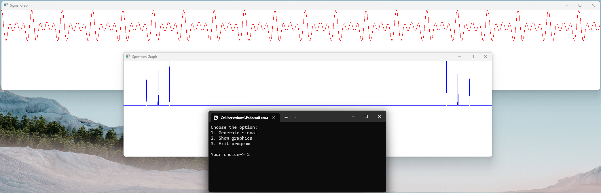

# Signal Generator & Spectrum Analyzer

## Overview
This program generates a signal as a sum of harmonics, computes its spectrum using FFTW, and visualizes both the signal and its spectrum using SFML. The application provides a simple menu to either generate the signal or display the graphics.

## Features
- Generate a composite signal based on harmonics defined by user input.
- Compute the FFT of the generated signal to analyze its spectrum.
- Display graphs for both the time-domain signal and the frequency-domain spectrum.

## Requirements
- C++20 or later
- SFML (fetched via CMake FetchContent)
- FFTW (pre-compiled and provided as libraries)

## Running the Application
After building, run the executable. The console will prompt for a choice:
- **Option 1**: Generate signal by entering harmonics frequency and amplitude.
- **Option 2**: Display graphics for the generated signal and spectrum.
- **Option 3**: Exit the program.
